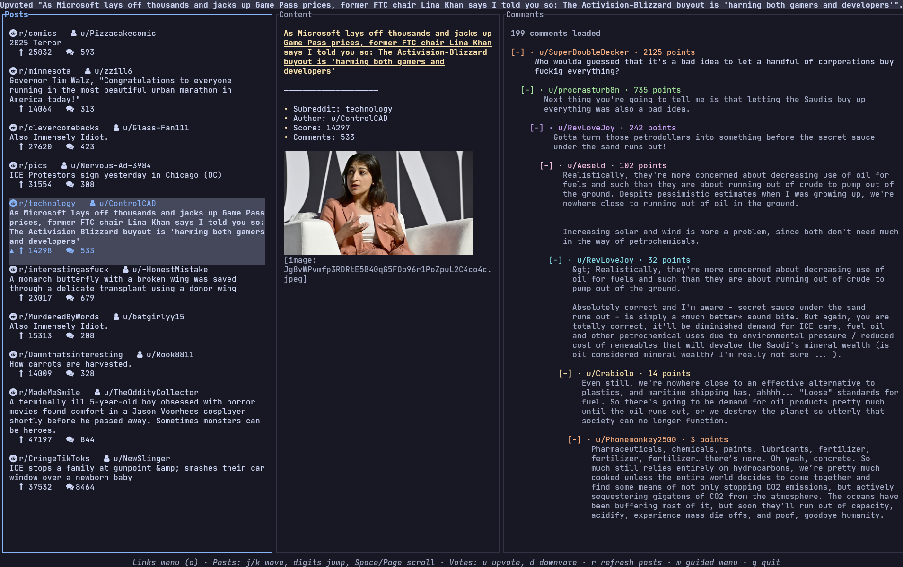

# Reddix

[](https://github.com/ck-zhang/reddix/releases/latest)
[](LICENSE)

Reddix - Reddit, refined for the terminal.



## Features

- Image previews based on the kitty graphics protocol
- Video playback via [mpv](https://mpv.io)'s Kitty integration
- Gallery browsing with inline navigation controls
- Multi-account support
- Keyboard-first navigation
- Smart caching
- NSFW filter toggle

## Install

### GitHub Releases

You can download the latest [release](https://github.com/ck-zhang/reddix/releases/latest) from GitHub

### Use the install script:

```sh
curl --proto '=https' --tlsv1.2 -LsSf https://github.com/ck-zhang/reddix/releases/latest/download/reddix-installer.sh | sh
```

### Install via Homebrew:

```sh
brew install reddix
```

### Install via AUR (Archlinux):
From source:
```sh
yay -S reddix
```
Binaries:
```sh
yay -S reddix-bin
```

## Quickstart

1. Create a Reddit “script” at [https://www.reddit.com/prefs/apps](https://www.reddit.com/prefs/apps) and set the redirect URI to `http://127.0.0.1:65010/reddix/callback`.
2. Launch `reddix`, press `m`, and follow the guided menu for setup.
3. Prefer to configure things manually? Copy [`docs/examples/config.yaml`](docs/examples/config.yaml) into `~/.config/reddix/config.yaml` and fill in your credentials.

Core shortcuts: `j/k` move, `h/l` change panes, `m` guided menu, `o` action menu, `r` refresh, `s` sync subs, `u/d` vote, `q` quit.

## Support

- I welcome feature requests and contributions; the project is still in its early stages.
- Track ongoing ideas in the [feature request log](docs/feature-requests.md).
- Donations: [https://ko-fi.com/ckzhang](https://ko-fi.com/ckzhang)
