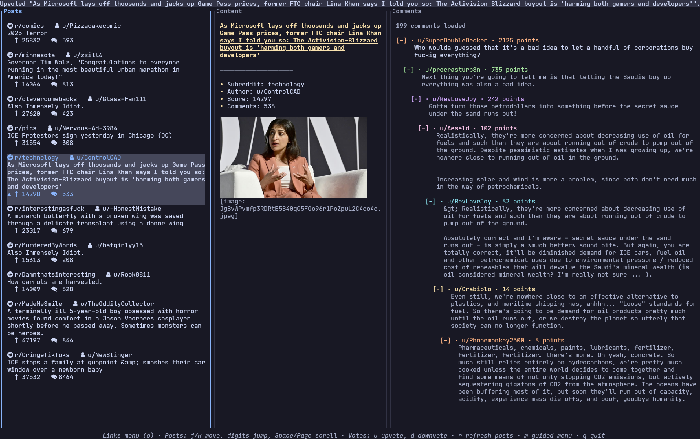

# Reddix

[](https://github.com/ck-zhang/reddix/releases/latest)
[](LICENSE)

Reddix - Reddit, refined for the terminal.



## Features

- Image previews based on the kitty graphics protocol
- Video playback via [mpv](https://mpv.io)'s Kitty integration
- Gallery browsing with inline navigation controls
- Multi-account support
- Keyboard-first navigation
- Smart caching
- NSFW filter toggle

## Install

### GitHub Releases

You can download the latest [release](https://github.com/ck-zhang/reddix/releases/latest) from GitHub

### Use the install script:

```sh
curl --proto '=https' --tlsv1.2 -LsSf https://github.com/ck-zhang/reddix/releases/latest/download/reddix-installer.sh | sh
```

### Install via Homebrew:

```sh
brew install reddix
```

### Install via AUR (Archlinux):
From source:
```sh
yay -S reddix
```
Binaries:
```sh
yay -S reddix-bin
```

## Quickstart

1. Apply for a Reddit “script” via the [Reddit support form](https://support.reddithelp.com/hc/en-us/requests/new?ticket_form_id=14868593862164&tf_14867328473236=api_request_type_enterprise). Once approved, set the redirect URI to `http://127.0.0.1:65010/reddix/callback`.
2. Launch `reddix`, press `m`, and follow the guided menu for setup.
3. Prefer to configure things manually? Copy [`docs/examples/config.yaml`](docs/examples/config.yaml) into `~/.config/reddix/config.yaml` and fill in your credentials.

Note: As of Nov 2025, Reddit blocked the old `reddit.com/prefs/apps` flow. Apply via the [Reddit support form](https://support.reddithelp.com/hc/en-us/requests/new?ticket_form_id=14868593862164&tf_14867328473236=api_request_type_enterprise) (context: https://www.reddit.com/r/redditdev/comments/1oug31u/introducing_the_responsible_builder_policy_new/).

Core shortcuts: `j/k` move, `h/l` change panes, `m` guided menu, `o` action menu, `r` refresh, `s` sync subs, `u/d` vote, `q` quit.

## Remote / SSH setup

When you run Reddix over SSH or on a headless machine, the guided menu’s “Open Link” step cannot open a browser on the remote host. You can still authorize:

1. Start Reddix on the remote, press `m`, and choose **Add account**. When the auth URL is generated, copy it from the menu (or from the URL shown in the UI).
2. Open that URL in a browser on your **local** machine and complete the Reddit login.
3. Ensure your Reddit app’s redirect URI points to the machine where Reddix is running (e.g. your server’s IP or hostname and port 65010), so the redirect reaches the Reddix callback after you authorize.

See [issue #13](https://github.com/ck-zhang/reddix/issues/13) for details and future improvements (e.g. displaying the auth URL for easy copy).

## Support

- I welcome feature requests and contributions; the project is still in its early stages.
- Track ongoing ideas in the [feature request log](docs/feature-requests.md).
- Donations: [https://ko-fi.com/ckzhang](https://ko-fi.com/ckzhang)
